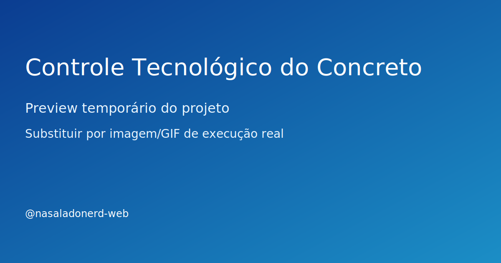

# Controle Tecnológico do Concreto

> 🚧 **Em construção:** este projeto está sendo desenvolvido aos poucos, com entregas incrementais.

## Problema
Consolidar e analisar ensaios de concreto para acompanhar conformidade com critérios técnicos e detectar desvios cedo.

## Solução
Scripts em Python para ingestão de resultados, análise estatística e geração de relatórios de acompanhamento tecnológico.

## Stack
- Python, pandas, matplotlib, scipy

## Resultado
- Estrutura inicial pronta para evolução incremental
- Base de código organizada para testes e documentação
- Repositório preparado para vitrine técnica no GitHub

## Demonstração


> Substitua depois por GIF real da execução (ex.: assets/demo.gif) assim que a primeira versão funcional estiver pronta.

## Status
**Em evolução**

## Roadmap curto
- [ ] Implementar versão mínima funcional (MVP)
- [ ] Adicionar exemplo de entrada e saída
- [ ] Publicar GIF de execução no README
- [ ] Criar seção de lições aprendidas

## Como executar (placeholder)
```bash
# em breve
```

## Próxima entrega da semana
- [ ] Criar estrutura de dados para importar resultados de ensaio
- [ ] Implementar cálculo inicial de média, desvio padrão e variabilidade
- [ ] Publicar gráfico simples de acompanhamento no README
